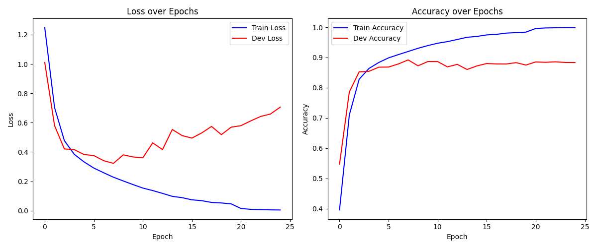

# Hyparameter
``` python
text_size = 1014
batch_size = 16
epochs = 100
num_class = 4
lr = 1e-3
mmt = 0.9
```

# Data (120k train, 7.6k test)
*[Link dataset](https://huggingface.co/datasets/wangrongsheng/ag_news)*

## Augment Data 

##### Swap các từ ngẫu nhiên 
###### Ví dụ: The Weather is very hot -> The Weather hot is very
```python
def swap(data):
  a = torch.randint(1, 10, (1,))
  words = data.split()
  n = len(words)
  for _ in range(a):
    i1, i2 = torch.randint(0, n, (2,))
    words[i1], words[i2] = words[i2], words[i1]
  return " ".join(words)
```


##### Xóa các từ ngẫu nhiên
###### Ví dụ: The Weather is very hot -> The Weather is hot 
```python
def dele(data, p = 0.1):
  words = data.split()
  a = torch.randn(len(words))
  a_norm = (a - a.min()) / (a.max() - a.min())
  new_words = []
  new_words += [word for idx, word in enumerate(words) if a_norm[idx] >= p]
  return " ".join(new_words)
```

##### Onehot từng kí tự thành vector 70 chiều

```python
def text2onehot(text, features = 70, max_length = text_size):
  one_hot_tensor = torch.zeros((features, max_length))
  text = text.lower()[:max_length]
  for idx, c in enumerate(text):
    if c in char2idx:
      one_hot_tensor[char2idx[c]][idx] = 1
  return one_hot_tensor
```

# Model
##### Model gồm ~12.4M tham số
##### Khởi tạo weight mean = 0, std = 0.05
```python 
class CharCNN(nn.Module):
  def __init__(self, num_class):
    super().__init__()
    self.layer1 = nn.Sequential(
        nn.Conv1d(in_channels = 70, out_channels = 256, kernel_size=7),
        nn.ReLU(),
        nn.MaxPool1d(kernel_size=3)
    )
    self.layer2 = nn.Sequential(
        nn.Conv1d(in_channels = 256, out_channels = 256, kernel_size=7),
        nn.ReLU(),
        nn.MaxPool1d(kernel_size=3)
    )
    self.layer3 = nn.Sequential(nn.Conv1d(in_channels = 256, out_channels = 256, kernel_size=3), nn.ReLU())
    self.layer4 = nn.Sequential(nn.Conv1d(in_channels = 256, out_channels = 256, kernel_size=3), nn.ReLU())
    self.layer5 = nn.Sequential(nn.Conv1d(in_channels = 256, out_channels = 256, kernel_size=3), nn.ReLU())
    self.layer6 = nn.Sequential(
        nn.Conv1d(in_channels = 256, out_channels = 256, kernel_size=3),
        nn.ReLU(),
        nn.MaxPool1d(kernel_size=3)
    )
    self.fc = nn.Sequential(
        nn.Linear(in_features=8704, out_features=1024),
        nn.ReLU(),
        nn.Dropout(0.5),

        nn.Linear(in_features=1024, out_features=1024),
        nn.ReLU(),
        nn.Dropout(0.5),

        nn.Linear(in_features=1024, out_features=num_class)
    )
    self.apply(self._init_weights)
  def _init_weights(self, module):
    if isinstance(module, nn.Conv1d) or isinstance(module, nn.Linear):
      nn.init.normal_(module.weight, mean = 0, std = 0.05)
      if module.bias is not None: nn.init.zeros_(module.bias)
  def forward(self, x):
    # x shape: (B, 70, 1014)
    x = self.layer1(x)   # (B, 256, 336)
    x = self.layer2(x)   # (B, 256, 110)
    x = self.layer3(x)   # (B, 256, 108)
    x = self.layer4(x)   # (B, 256, 106)
    x = self.layer5(x)   # (B, 256, 104)
    x = self.layer6(x)   # (B, 256,  34)
    x = torch.flatten(x, 1)  # (B, 8704)
    x = self.fc(x)
    return x
```
# Loss, Optimizer, Scheduler
#### Loss: CrossEntropy Loss
#### Optimizer: SGD + MMT
#### Scheduler step_size = 20, gm = 0.1
```python 
cel = nn.CrossEntropyLoss()
optimizer = optim.SGD(
    model.parameters(),
    lr = lr,
    momentum=mmt, 
)
scheduler = torch.optim.lr_scheduler.StepLR(
    optimizer, step_size=20, gamma=0.1
)
```

